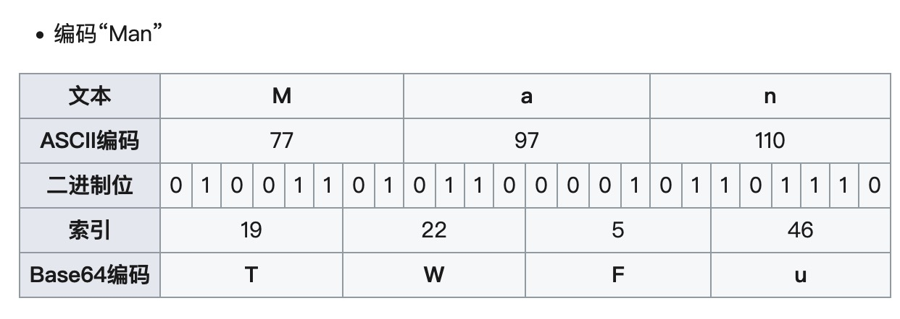

1. **Base64**不是一种编码， 而是一种基于64个可打印字符来表示[二进制数据](https://zh.wikipedia.org/wiki/二进制)的表示方法。

由于 2^{6}=64，所以每6个[比特](https://zh.wikipedia.org/wiki/位元)为一个单元，对应某个可打印字符。3个[字节](https://zh.wikipedia.org/wiki/字节)(一个字节为8位)有24个比特，对应于4个Base64单元，即3个字节可由4个可打印字符来表示。

2. Base64常用于在通常处理文本数据的场合，表示、传输、存储一些二进制数据，包括MIME的电子邮件及XML的一些复杂数据。
3. 编码示例
 

- 根据每6位的值对应成一个**64可打印的字符**，从而推导出**“19 = T，22=w， 5=F， 46=u”**

4. Base64的所用表

   

5. 如果要编码的字节数不能被3整除**（3个字节正好可以用来对应4个字符）**，最后会多出1个或2个字节，那么可以使用下面的方法进行处理：先使用0字节值在末尾补足，使其能够被3整除，然后再进行Base64的编码。在编码后的Base64文本后加上一个或两个`=`号，代表补足的字节数。也就是说，当最后剩余两个八位字节（2个byte）时，最后一个6位的Base64字节块有四位是0值，最后附加上两个等号；如果最后剩余一个八位字节（1个byte）时，最后一个6位的base字节块有两位是0值，最后附加一个等号。