#### 1. 关键字

> TCP/IP协议族
>
> 协议（protocol）

#### 2. 摘要

> 计算机与网络设备要相互通信，双方就必须基于相同的方法。
>
> TCP/IP协议族里重要的一点就是分层
>
> 。TCP/IP协议族按层次分别分为以下4层：应用层、传输层、网络层和数据链路层。

> 应用层应用层决定了向用户提供应用服务时通信的活动。
>
> 传输层对上层应用层，提供处于网络连接中的两台计算机之间的数据传输。TCP（Transmission Control Protocol，传输控制协议）和UDP（User Data Protocol，用户数据报协议）
>
> 网络层（又名网络互连层）网络层用来处理在网络上流动的数据包
>
> 链路层（又名数据链路层，网络接口层）用来处理连接网络的硬件部分。

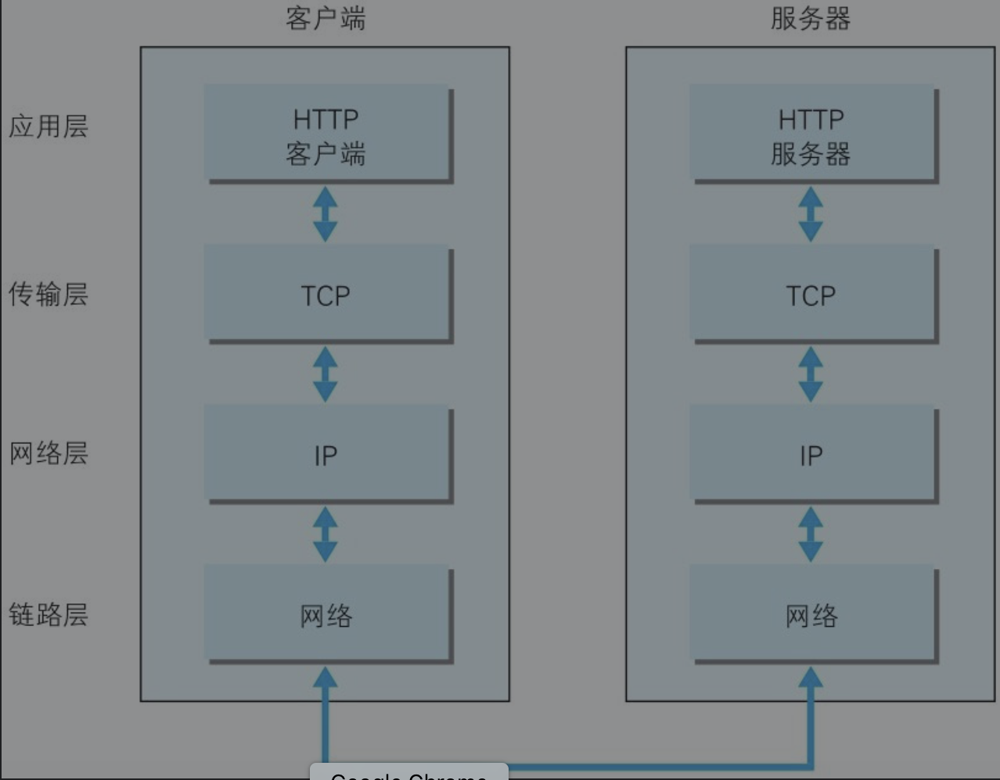

在应用层（HTTP协议）发出一个想看某个Web页面的HTTP请求。

为了传输方便，在传输层（TCP协议）把从应用层处收到的数据（HTTP请求报文）进行分割，并在各个报文上打上标记序号及端口号后转发给网络层

在网络层（IP协议），增加作为通信目的地的MAC地址后转发给链路层。这样一来，发往网络的通信请求就准备齐全了。

接收端的服务器在链路层接收到数据，按序往上层发送，一直到应用层。当传输到应用层，**才能算真正接收到由客户端发送过来的HTTP请求**

发送端在层与层之间传输数据时，每经过一层时必定会被打上一个该层所属的**首部信息**。反之，接收端在层与层传输数据时，每经过一层时会把对应的首部消去。这种把数据信息包装起来的做法称为封装（encapsulate

- TCP位于传输层，提供可靠的字节流服务

  - 字节流服务（Byte Stream Service）是指，为了方便传输，将大块数据分割成以报文段（segment）为单位的数据包进行管理。

  - 可靠的传输服务是指，能够把数据准确可靠地传给对方。

  - TCP协议为了更容易传送大数据才把数据分割，而且TCP协议能够确认数据最终是否送达到对方。

  - TCP协议采用了三次握手（three-way handshaking）策略

  - 握手过程中使用了TCP的标志（flag）——SYN（synchronize）和ACK（acknowledgement

    - 发送端首先发送一个带SYN标志的数据包给对方
    - 接收端收到后，回传一个带有SYN/ACK标志的数据包以示传达确认信息
    - 发送端再回传一个带ACK标志的数据包
    - 代表“握手”结束。
    - 
     
    
     

 ####1. 5 负责域名解析的DNS服务
 - DNS（Domain Name System）服务是和HTTP协议一样位于应用层的协议。它提供**域名**到**IP地址**之间的解析服务。
 - 背景:  与IP地址的一组纯数字相比，用字母配合数字的表示形式来指定计算机名更符合人类的记忆习惯,计算机更擅长处理一长串数字
 - DNS协议提供通过域名查找IP地址，或逆向从IP地址反查域名的服务。
 - 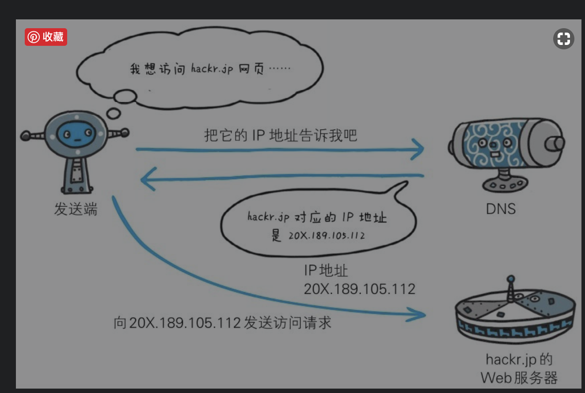

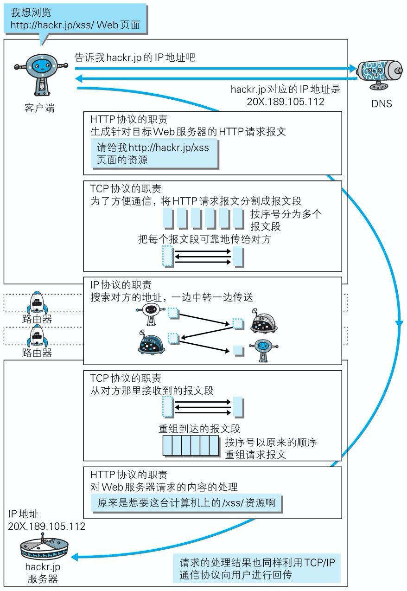

##### 1.7 URI URL

URI: 统一资源标识符 - Uniform Resource Identifier

URL: 统一资源定位符- Uniform Resource Locator

##### 2. 简单的Http协议 终于进入第二章了 兄弟

##### 2.1 HTTP协议和TCP/IP协议族内的其他众多的协议相同，用于客户端和服务器之间的通信

##### 2.2 通过请求和响应的交换达成通信

- 请求报文是由请求方法、请求URI、协议版本、可选的请求首部字段和内容实体构成的。
  - 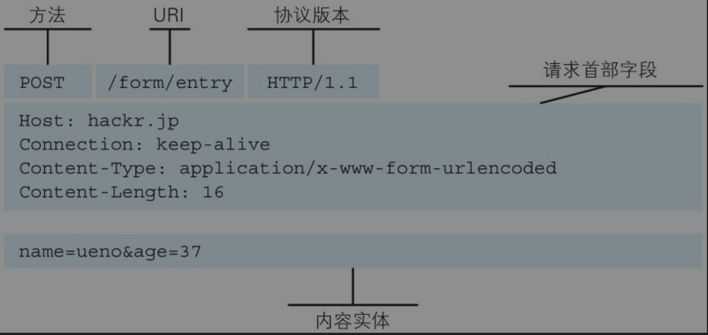

- 响应报文基本上由协议版本、状态码（表示请求成功或失败的数字代码）、用以解释状态码的原因短语、可选的响应首部字段以及实体主体构成。
  - 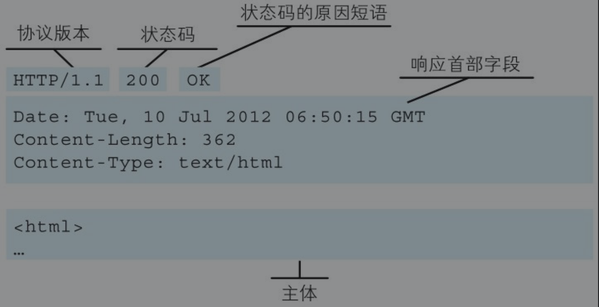

##### 2.3 HTTP是不保存状态的协议 stateless

- 原因: 这是为了更快地处理大量事务，确保协议的可伸缩性，而特意把HTTP协议设计成如此简单的。
- 为了实现期望的保持状态功能，于是引入了Cookie技术

##### 2.4 请求URI定位资源

- HTTP协议使用URI定位互联网上的资源

##### 2.5 告知服务器意图的HTTP方法

GET：获取资源GET方法用来请求访问已被URI识别的资源。 => 我要什么 

POST方法用来传输实体的主体。==》 我给什么

PUT：传输文件

CONNECT：要求用隧道协议连接代理,CONNECT方法要求在与代理服务器通信时建立隧道，实现用隧道协议进行TCP通信

#### 2.7 持久连接节省通信量

HTTP协议的初始版本中，每进行一次HTTP通信就要断开一次TCP连接。每次的请求都会造成无谓的TCP连接建立和断开，增加通信量的开销。

##### 2.7.1 持久连接

HTTP/1.1和一部分的HTTP/1.0想出了持久连接（HTTPPersistent Connections，也称为HTTP keep-alive或HTTP connection reuse）的方法。持久连接的特点是，只要任意一端没有明确提出断开连接，则保持TCP连接状态。

- 持久连接的好处在于减少了TCP连接的重复建立和断开所造成的额外开销，减轻了服务器端的负载。
- 在HTTP/1.1中，所有的连接默认都是持久连接

2.7.2 管线化

持久连接使得多数请求以管线化（pipelining）方式发送成为可能,同时并行发送多个请求

#### 2.8使用Cookie的状态管理

Cookie技术通过在请求和响应报文中写入Cookie信息来控制客户端的状态。

Cookie会根据从服务器端发送的响应报文内的一个叫做Set-Cookie的首部字段信息，通知客户端保存Cookie。当下次客户端再往该服务器发送请求时，客户端会自动在请求报文中加入Cookie值后发送出去。

服务器端发现客户端发送过来的Cookie后，会去检查究竟是从哪一个客户端发来的连接请求，然后对比服务器上的记录，最后得到之前的状态信息。

①请求报文（没有Cookie信息的状态）

②响应报文（服务器端生成Cookie信息）

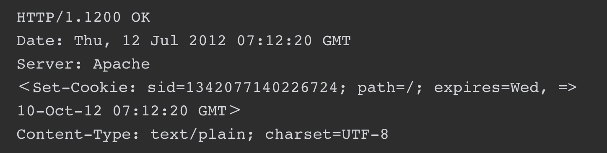

③请求报文（自动发送保存着的Cookie信息）

#### 3. Http豹纹内的http 信息

##### 3.1 HTTP报文

- 请求端（客户端）的HTTP报文叫做请求报文
- 响应端（服务器端）的叫做响应报文
- HTTP报文大致可分为报文首部和报文主体两块,两者由最初出现的空行（CR+LF）来划分

##### 3.2 请求报文及响应报文的结构

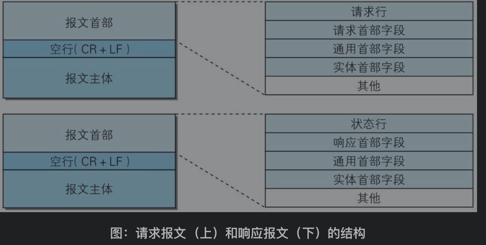

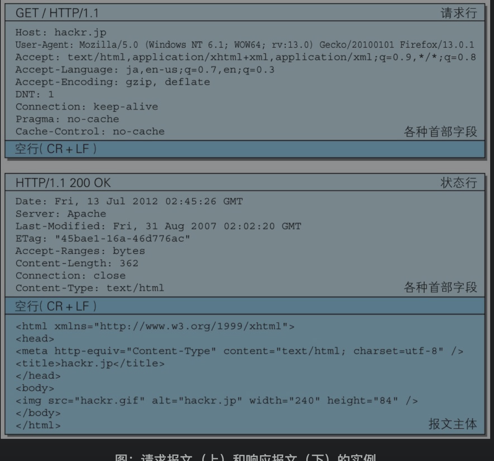

- 请求行: 包含用于请求的方法，请求URI和HTTP版本
- 状态行: 包含表明响应结果的状态码，原因短语和HTTP版本

#### 3.3 编码提升传输速率

- 报文（message: 是HTTP通信中的基本单位，由8位组字节流
- 实体（entity）: 作为请求或响应的有效载荷数据（补充项）被传输，其内容由实体首部和实体主体组成。

3.3.2 压缩传输的内容编码

内容编码指明应用在实体内容上的编码格式，并保持实体信息原样压缩。内容编码后的实体由客户端接收并负责解码。

常用的内容编码有以下几种。

●gzip（GNU zip）●compress（UNIX系统的标准压缩）●deflate（zlib）●identity（不进行编码）

分块传输编码: 将实体主体分成多个部分（块）。每一块都会用十六进制来标记块的大小，而实体主体的最后一块会使用“0(CR+LF)”来标记

#### 发送多种数据的多部分对象集合
1. 添加多份附件 采用了MIME（Multipurpose Internet Mail Extensions，多用途因特网邮件扩展）机制 

- 允许邮件处理文本、图片、视频等多个不同类型的数据

- 图片等二进制数据以ASCII码字符串编码的方式指明，就是利用MIME来描述标记数据类型。而在MIME扩展中会使用一种称为多部分对象集合（Multipart）的方法，来容纳多份不同类型的数据

multipart/form-data: Web表单文件上传时使用

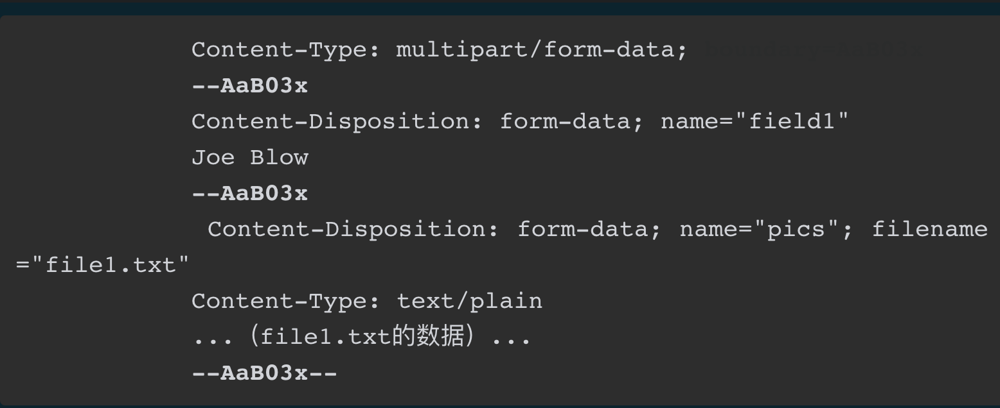

使用boundary字符串来划分多部分对象集合指明的各类实体

##### 3.5 获取部分内容的范围请求

- 场景: 下载一个尺寸稍大的图片或文件就已经很吃力了。如果下载过程中遇到网络中断的情况,需要一种可恢复的机制。所谓恢复是指能从之前下载中断处恢复下载

- 指定范围发送的请求叫做范围请求（RangeRequest）。
- 针对范围请求，响应会返回状态码为206 Partial Content的响应报文。另外，对于多重范围的范围请求，响应会在首部字段Content-Type标明multipart/byteranges后返回响应报文。
- 如果服务器端无法响应范围请求，则会返回状态码200 OK和完整的实体内容。

#### 3.6 内容协商返回最合适的内容

访问相同URI的Web页面时，则会显示对应的英语版或中文版的Web页面。这样的机制称为内容协商（Content Negotiation）

内容协商机制是指客户端和服务器端就响应的资源内容进行交涉，然后提供给客户端最为适合的资源。内容协商会以响应资源的语言、字符集、编码方式等作为判断的基准。

●Accept

●Accept-Charset

●Accept-Encoding

●Accept-Language

●Content-Language

#### 4 状态码

##### 4.1 状态码告知从服务器端返回的请求结果

- 状态码的职责是当客户端向服务器端发送请求时，描述返回的请求结果。借助状态码，用户可以知道服务器端是正常处理了请求，还是出现了错误

- 数字中的第一位指定了响应类别，后两位无分类。响应类别有以下5种
  - 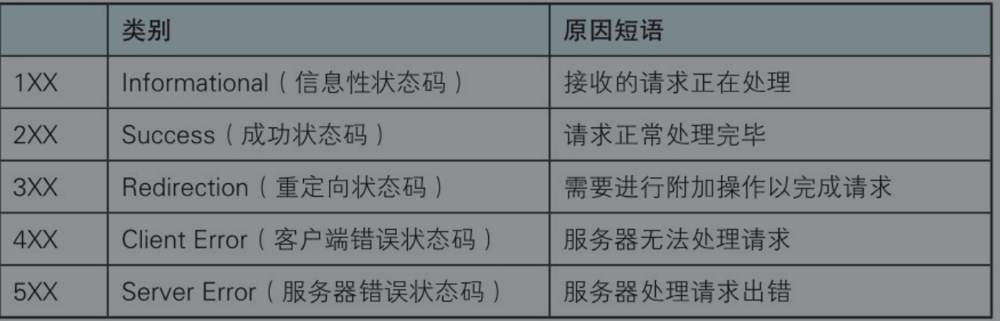

##### 4.2 2XX成功

- 200 OK 表示从客户端发来的请求在服务器端被正常处理了。
- 2204 No Content,该状态码代表服务器接收的请求已成功处理，但在返回的响应报文中不含实体的主体部分。另外，也不允许返回任何实体的主体。
- 206 Partial Content, 客户端进行了范围请求，而服务器成功执行了这部分的GET请求。响应报文中包含由Content-Range指定范围的实体内容。

##### 4.3 3XX重定向

- 301 Moved Permanently.永久性重定向。该状态码表示请求的资源已被分配了新的URI，以后应使用资源现在所指的URI。
- 302 Found,临时性重定向。该状态码表示请求的资源已被分配了新的URI，希望用户（本次）能使用新的URI访问。
- 303 See Other,由于请求对应的资源存在着另一个URI，应使用GET方法定向获取请求的资源
- 304 Not Modified 服务器端允许请求访问资源，但因发生请求未满足条件的情况后，直接返回304 Not Modified（服务器端资源未改变，可直接使用客户端未过期的缓存)
- 307 Temporary Redirect.临时重定向

##### 4.4 4XX客户端错误

- 400 Bad Request, 请求报文中存在语法错误
- 401Unauthorized, 送的请求需要有通过HTTP认证（BASIC认证、DIGEST认证）的认证信息。另外若之前已进行过1次请求，则表示用户认证失败
- 403 Forbidden 对请求资源的访问被服务器拒绝了服务器端没有必要给出拒绝的详细理由，
- 404  Not Found, 服务器上无法找到请求的资源。

##### 4.5 5XX服务器错误

- 500 Internal Server Error 服务器端在执行请求时发生了错误
- 503 Service Unavailable 服务器暂时处于超负载或正在进行停机维护，现在无法处理请求
  - 如果事先得知解除以上状况需要的时间，最好写入Retry-After首部字段再返回给客户端。

#### 5. 与Http协作的web服务器

##### 5.1 用单台虚拟主机实现多个域名

- HTTP/1.1规范允许一台HTTP服务器搭建多个Web站点
- 即使物理层面只有一台服务器，但只要使用虚拟主机的功能，则可以假想已具有多台服务器。
  - 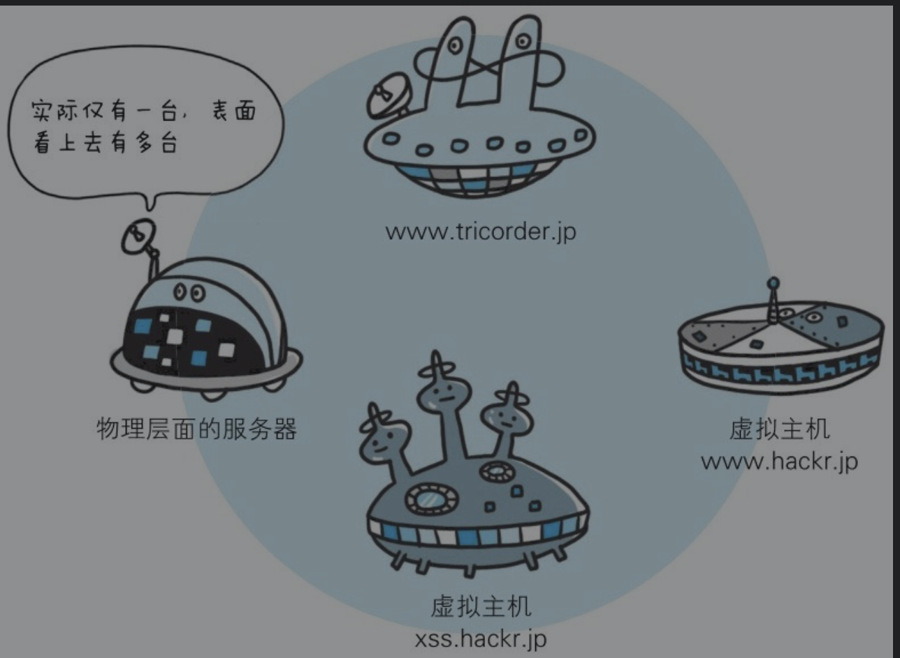

##### 5.2 通信数据转发程序：代理、网关、隧道

HTTP通信时，除客户端和服务器以外，还有一些用于通信数据转发的应用程序，例如代理、网关和隧道。它们可以配合服务器工作。

这些应用程序和服务器可以将请求转发给通信线路上的下一站服务器，并且能接收从那台服务器发送的响应再转发给客户端。

- 代理, 一种有转发功能的应用程序,它扮演了位于服务器和客户端“中间人”的角色，
  - 它扮演了位于服务器和客户端“中间人”的角色，
  - 接收由客户端发送的请求并转发给服务器，
  - 接收服务器返回的响应并转发给客户端。
- 网关: 转发其他服务器通信数据的服务器
  - 接收从客户端发送来的请求时，它就像自己拥有资源的源服务器一样对请求进行处理
- 隧道: 相隔甚远的客户端和服务器两者之间进行中转, 并保持双方通信连接的应用程序

##### 代理

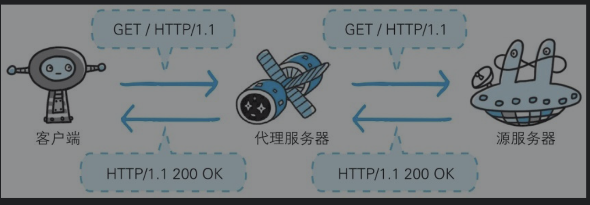

持有资源实体的服务器被称为源服务器。从源服务器返回的响应经过代理服务器后再传给客户端。

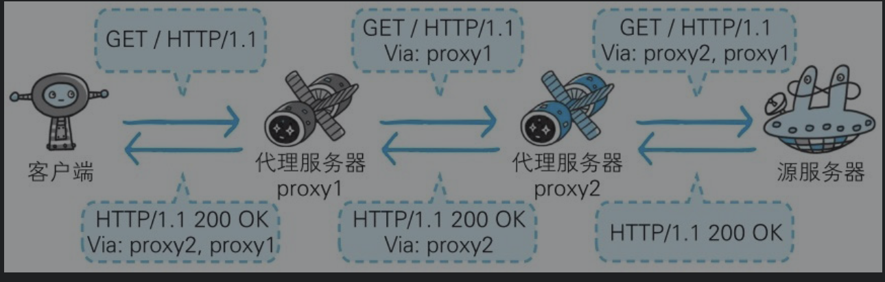

在HTTP通信过程中，可级联多台代理服务器。请求和响应的转发会经过数台类似锁链一样连接起来的代理服务器。转发时，需要附加Via首部字段以标记出经过的主机信息。

使用代理服务器的理由有：利用缓存技术（稍后讲解）减少网络带宽的流量，组织内部针对特定网站的访问控制，以获取访问日志为主要目的，等等。

代理有多种使用方法，按两种基准分类。一种是是否使用缓存，另一种是是否会修改报文。

- 缓存代理: 预先将资源的副本（缓存）保存在代理服务器上。再次接收到对相同资源的请求时，就可以不从源服务器那里获取资源，而是将之前缓存的资源作为响应返回。
- 透明代理: 转发请求或响应时，不对报文做任何加工的代理类型被称为透明代理

#### .  网关

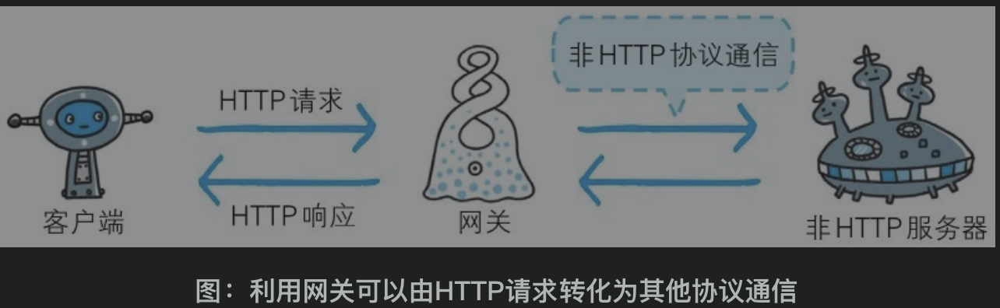

网关的工作机制和代理十分相似。而网关能使通信线路上的服务器提供非HTTP协议服务。

利用网关能提高通信的安全性，因为可以在客户端与网关之间的通信线路上加密以确保连接的安全。

##### 隧道

隧道可按要求建立起一条与其他服务器的通信线路，届时使用SSL等加密手段进行通信。隧道的目的是确保客户端能与服务器进行安全的通信。

隧道本身不会去解析HTTP请求。也就是说，请求保持原样中转给之后的服务器。隧道会在通信双方断开连接时结束。

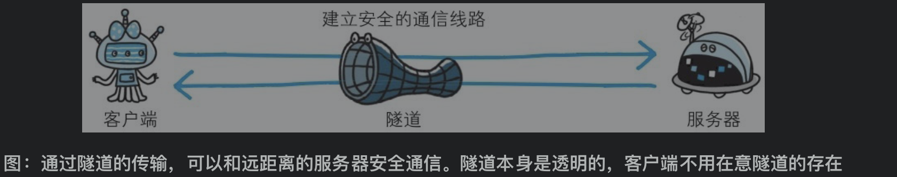

##### 5.3 保存资源的缓存

- 缓存是指代理服务器或客户端本地磁盘内保存的资源副本
  - 利用缓存可减少对源服务器的访问
  - 节省了通信流量和通信时间
  - 缓存服务器是代理服务器的一种
  - 用缓存可避免多次从源服务器转发资源,
    - 近从缓存服务器上获取资源，而源服务器也不必多次处理相同的请求

##### 缓存的有效期限

- 缓存资源的有效性问题

FTP（File Transfer Protocol）: 传输文件时使用的协议。

#### 6. Http 首部

