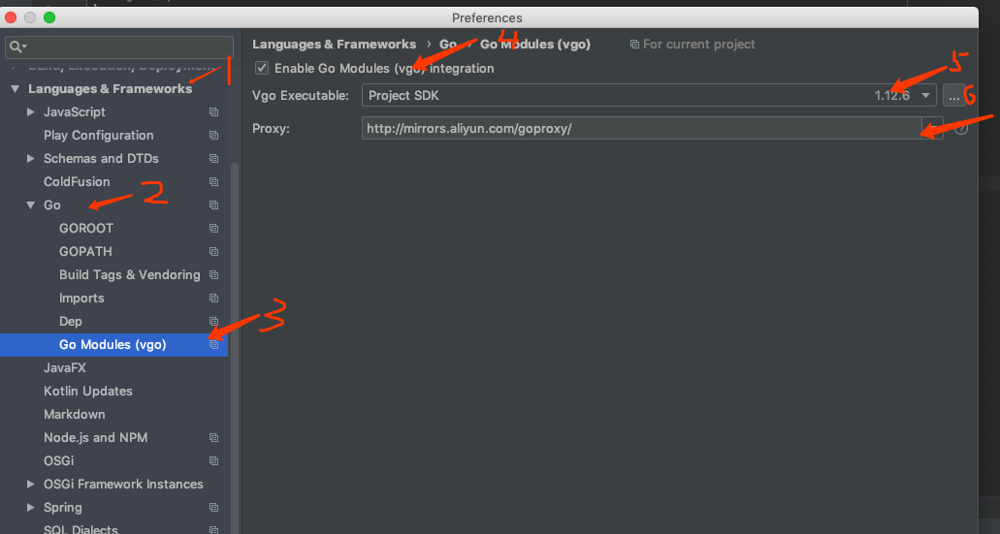

### 遇到的问题
#### go mode 在import 项目中其他package 文件
before

```go
package main

import (
	"github.com/gin-gonic/gin"
	"./api"
)

func main() {
	r := gin.Default()
	r.GET("/ping", func(c *gin.Context) {
		api.Go()
		c.JSON(200, gin.H{
			"message": "pong",
		})
	})
	r.Run(":80") // listen and serve on 0.0.0.0:8080
}
```

after

```
package main

import (
	"github.com/gin-gonic/gin"
	"xxxx/api"
)

func main() {
	r := gin.Default()
	r.GET("/ping", func(c *gin.Context) {
		api.Go()
		c.JSON(200, gin.H{
			"message": "pong",
		})
	})
	r.Run(":80") // listen and serve on 0.0.0.0:8080
}
```


#### go mod 在goland 或者 intellij 错误错误

[解决办法]([https://blog.jetbrains.com/cn/2019/03/go-%E6%A8%A1%E5%9D%97%E4%BD%BF%E7%94%A8%E6%8C%87%E5%8D%97/](https://blog.jetbrains.com/cn/2019/03/go-模块使用指南/)) : 



