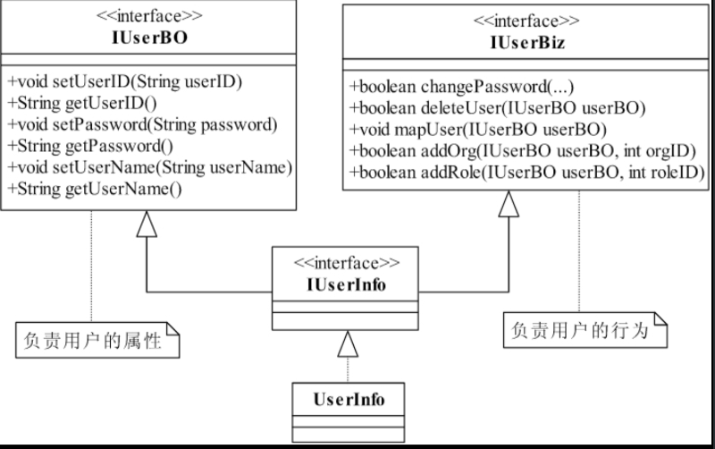
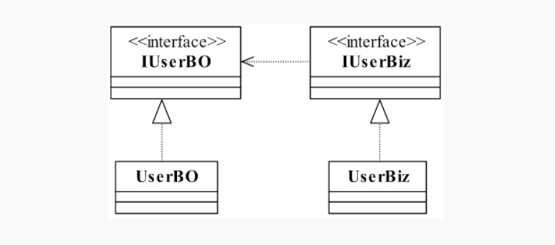

#### 单一职责原则(Single Responsibility Principle SRP)
- RBAC模型（Role-Based Access Control，基于角色的访问控制，通过分配和取消角色来完成用户权限的授予和取消，使动作主体（用户）与资源的行为（权限）分离

##### 设计一个用户管理类 '

  - 优化前

    

> 用户的属性和用户的行为没有分开，这是一个严重的错误！这个接口确实设计得一团糟，

	- 优化后

   

> 应该把用户的信息抽取成一个BO（Business Object，业务对象），把行为抽取成一个Biz（Business Logic，业务逻辑），按照这个思路对类图进行修正.应该把用户的信息抽取成一个BO（Business Object，业务对象），把行为抽取成一个Biz（Business Logic，业务逻辑），按照这个思路对类图进行修正，

##### 再次优化

- 为什么要把一个接口拆分成两个呢？其实，在实际的使用中，我们更倾向于使用两个不同的类或接口：一个是IUserBO，一个是IUserBiz.
- 在实际的使用中，我们更倾向于使用两个不同的类或接口：一个是IUserBO，一个是IUserBiz，

