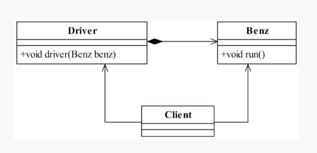
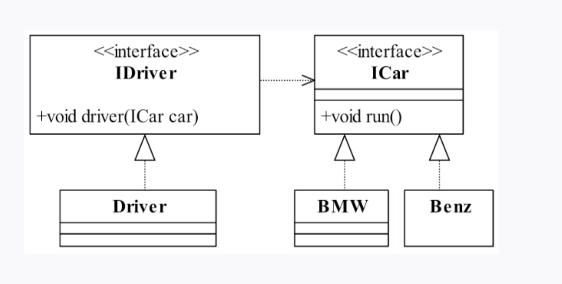

采用依赖倒置原则可以减少类间的耦合性，提高系统的稳定性，降低并行开发引起的风险，提高代码的可读性和可维护性。

- 奔驰车可以提供一个方法run，代表车辆运行

以上设计会带来一个问题

- 业务需求变更永无休止，技术前进就永无止境，在发生变更时才能发觉我们的设计或程序是否是松耦合. **好的设计能尽量适应需求的变化(我注的)**

- 后果 - 如果不使用依赖倒置原则就会加重类间的耦合性，降低系统的稳定性，增加并行开发引起的风险，降低代码的可读性和可维护性。

#### 优化后

建立两个接口：IDriver和ICar，分别定义了司机和汽车的各个职能，司机就是驾驶汽车，必须实现drive()方法, **这样的设计就是不需要关心具体是什么车, 只要具备父类run的功能就好了**