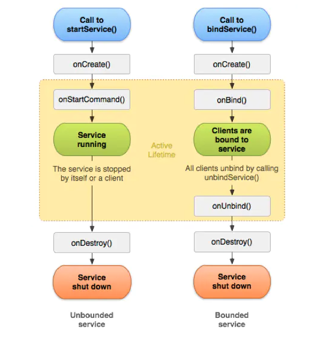

##    1. Android类加载器

- 基于Android系统的类加载器ClassLoader
- Android平台上虚拟机运行的是Dex字节码，一种对class文件优化的产物
  - dex文件: Dex 文件是很多 .class 文件处理后的产物，最终可以在 Android 运行时环境执
  - 优点 压缩空间, 消耗内存小
- 类加载器有两种，DexClassLoader和PathClassLoader,
  - 继承于BaseDexClassLoade
  - 区别在于调用父类构造器时，
    - DexClassLoader多传了一个optimizedDirectory参数,这个目录必须是内部存储路径，用来缓存系统创建的Dex文件。
    - PathClassLoader该参数为null，只能加载内部存储目录的Dex文件。

## 2.  Service

 

- 启动方式:

  - startService

    - 只有在外部调用Context的stopService或Service内部调用Service的stopSelf方法时，该Service才会停止运行并销毁

    - onCreated:

      -  service未启动的时候, 调用startService 会调用改方法`onCreated`, 
      - service启动的时候, 再次调用startService的时候, 不会触发onCreated

    - onStartCommand
  
    - 调用startService 的时候就会触发 该方法
  
      - 当Android面临内存匮乏的时候，可能会销毁掉你当前运行的Service，然后待内存充足的时候可以重新创建Service，Service被Android系统强制销毁并再次重建的行为依赖于Service中onStartCommand方法的返回值。我们常用的返回值有三种值，`START_NOT_STICKY`、`START_STICKY`和`START_REDELIVER_INTENT`，这三个值都是Service中的静态常量。
  
    - onBind
  
      - Service中的onBind方法是抽象方法，所以Service类本身就是抽象类，也就是onBind方法是必须重写的，即使我们用不到。在通过startService使用Service时，我们在重写onBind方法时，只需要将其返回null即可。onBind方法主要是用于给bindService方法调用Service时才会使用到。
  
    - ##### onDestroy
  
      onDestroy: 通过startService方法启动的Service会无限期运行，只有当调用了Context的stopService或在Service内部调用stopSelf方法时，Service才会停止运行并销毁，在销毁的时候会执行Service回调函数。
  
      - 
  
  - bindService

